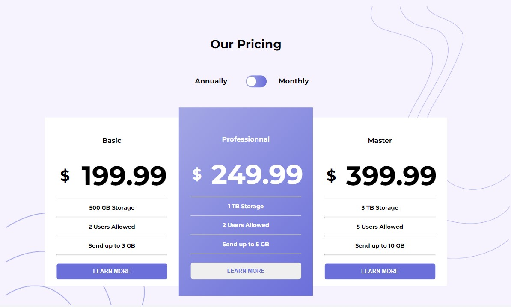
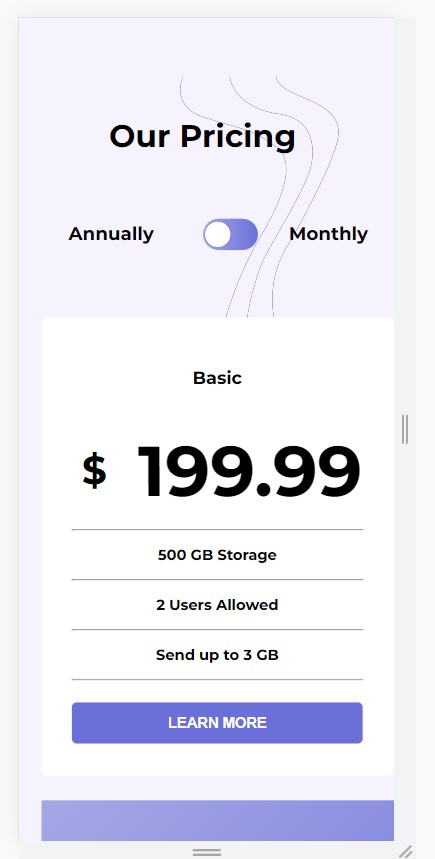

# Pricing Component

## Description
Voici le premier challenge: un composent de prix. Composent facilement intégrable a n'importe quel site vendant un ou des services ! 
Vous trouverez la maquette de celui ci dans le lien si dessous. Vous pouvez partir d'un fork du repo Github, les assets, la font ainsi qu'un compileur (Parcel.js) est déjà installé ! 
Libres a vous d'installer un préprocesseur ou un framework si vous le souhaiter. 

Essayez de reproduire le plus fidèlement possible la maquette. Le breakpoint est a 1024px. 
Le switch Annually / Monthly doit etre accesible a la souris et clavier. 
Pour les plus aggueri, essayer de realiser le challenge sans Javascript. 

Vous etes libre de mettre ce composant dans un portfolio ou autre. 
Rendez vous dans ? Pour echanger et partager les resultats ! 
(Projet venant de Frontend mentor. Repo et maquette realiser par nos soin, il y a quelques petites coquilles sur celle ci. On debute sur Figma, on va s'ameliorer avec le temps, on vous le promets, ne nous en voulez pas ! ).


<p align="center">
</p>

## Installation 
⚠️ Node.js is require 

For install packages:
```
npm install 
```

For lunch the server:
```
npm run start
```
Server should be running at http://localhost


## Hosting
Run a build
```
npm run build
```
In the host select the dist folder


## Figma
- [Prototype](https://www.figma.com/proto/IaAGuWoX2w26vKjfdCcgdq/Component?page-id=0%3A1&node-id=14%3A225&scaling=min-zoom&starting-point-node-id=14%3A225&show-proto-sidebar=1)
- [Design](https://www.figma.com/file/IaAGuWoX2w26vKjfdCcgdq/Component?node-id=0%3A1)

## Participants

https://pascalinecte91.github.io/Pricing_component_LF/
